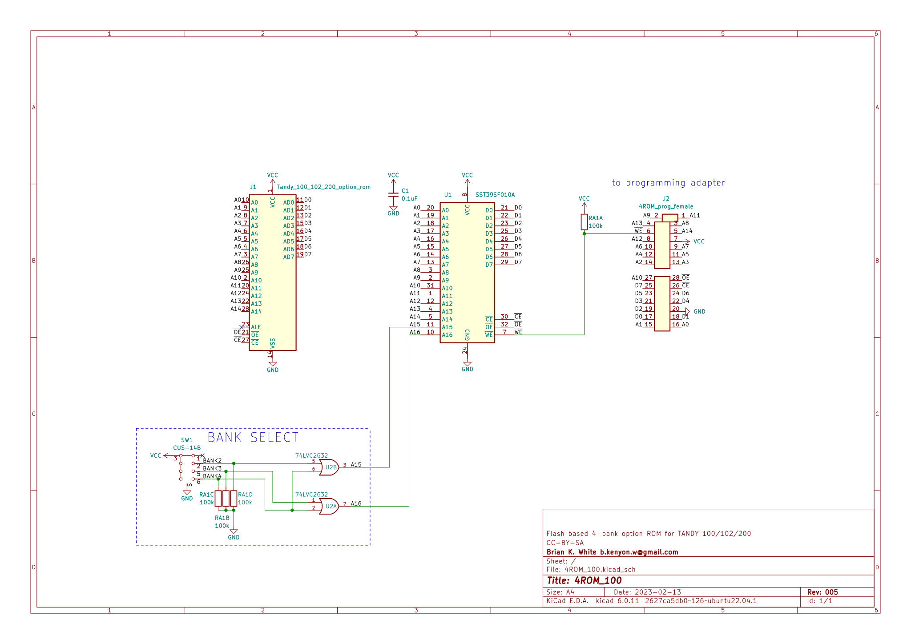
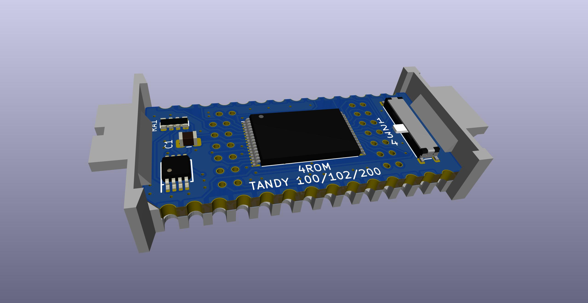
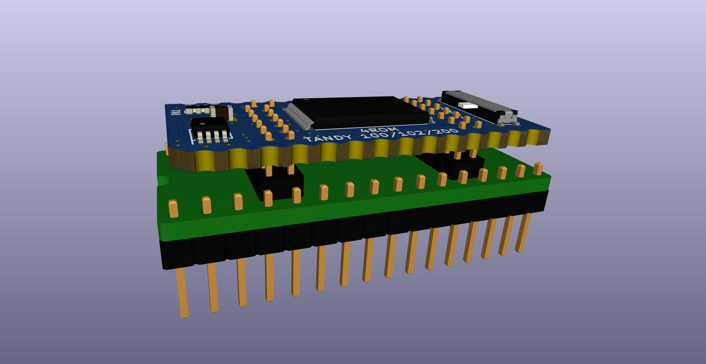
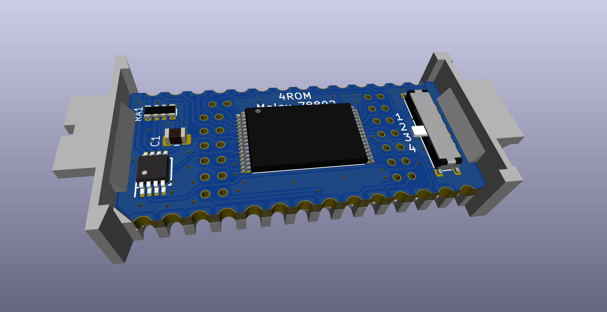
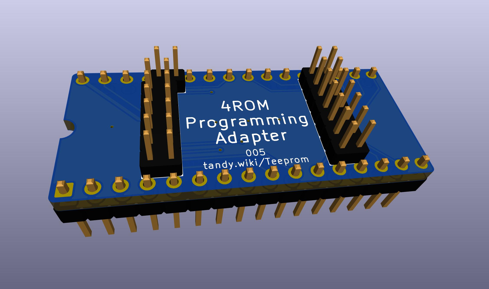

# 4ROM


### 4ROM_100 PCB
PCB https://www.pcbway.com/project/shareproject/4ROM_100_multi_option_rom_module_for_TRS_80_Model_100_102_200_93cfa6c8.html  

### 4ROM_78802 PCB
PCB https://www.pcbway.com/project/shareproject/4ROM_78802_714ecf32.html  

### BOM
BOM https://www.mouser.com/ProjectManager/ProjectDetail.aspx?AccessID=66e12c3f20 or https://www.digikey.com/short/whn7w258  

### Carrier
Carrier http://shpws.me/SGGB  

### Programming Adapter
PCB https://www.pcbway.com/project/shareproject/4ROM_Programming_Adapter_fc156337.html  
BOM https://www.mouser.com/ProjectManager/ProjectDetail.aspx?AccessID=a770931c82 or https://www.digikey.com/short/f3jhw9v1

This is a version of Teeprom and Meeprom that uses a 128K 29F010 flash instead of a 32K 28C256 eeprom.

When ordering the PCB:  
* Select ENIG copper finish so that the castellated edge contacts and programming adapter contacts will be gold plated.  
* Change the min tacks/spaces option to 6/6mils. The PCBWAY web site automatically selects 5/5 for this board for some reason, but there are no such thin traces or spaces.

The advantages over the original Teeprom are:  
* The flash chip is cheaper and more readily available. The 32K eeprom are now about $15 each and there is only one manufacturer. 128K flash is $1.40, and there are multiple manufacturers.  
* The programming adapter is cheaper to buy and simpler to use than the soic test clip and wires needed for Teeprom/Meeprom.
* Holds four 32K rom images instead of one.  

The disadvantages are:  
* The board has more parts and finer pitch part and is more difficult to solder.

There are 2 versions,  
'''4ROM_100''' is only for TANDY 100, 102, & 200, same as Teeprom.

'''4ROM_78802''' is for everything else, Same as Meeprom.  
TANDY 600, Epson PX-4 & PX-8, various industrial applications, most anywhere the Molex 78805 socket is found,  
but NOT for TANDY 100, 102, or 200

All BOM parts, Carrier, and programming adapter are the same for both 100 and 78802 versions.  
The difference is only in the pinout of the edge connectors on the PCBs. TRS-80/TANDY models 100, 102, & 200 need a non-standard pinout. The 78802 version provides a standard 27C256 pinout.  












## To write to the chip:  
* Put the 4ROM programming adapter into a programmer.  
* Remove the 4ROM PCB from the carrier and connect it to the programming adapter by the center pins. Don't try to push the pcb all the way down. Just get the pins into the holes at all and that should be good. It should feel stiff.  
* Select the desired bank number with the slide switch on the 4ROM.  
* Configure the programmer
  * Device: "SST39SF010A"
  * Ignore size mismatch
  * Do NOT automatically erase device before writing (1)
* Write a single 32K rom image.

(1) ...unless it's the first time and you actually do want to erase all 4 banks to ensure a clean slate, or to ensure un-used banks don't have random data. Even though some address lines are physically not connected and you physically can't write data anywhere except the currently selected bank, the "erase all" function is different. It's just a single command to the chip and the chip does it all itself internally. So you CAN erase all 128k even though you can only write data to the selected 32k chunk. Normally you don't want this since you want to write one bank without touching the others.

The following example usses a TL-866II+ programmer and the open source [minipro](https://gitlab.com/DavidGriffith/minipro) software.  
(If buying a new programmer, be aware that minipro does not support the new T56 programmer, has only preliminary and incomplete support for the T48. For best results use TL-866II+ and older models.)

### Test the pin connections  
Just to verify that the board is soldered correctly and all of the programming adapter pins are making a good connection.  
It should say pins 2 and 3 are bad, and nothing else.  
```
$ minipro -p 'SST39SF010A' -z
Found TL866II+ 04.2.132 (0x284)
Bad contact on pin:2
Bad contact on pin:3
$
```

"Bad contact" on pins 2 & 3 is expected. Those are the 2 highest address bits A15 and A16, which aren't connected to the outside world. They are only connected to the bank-select logic on the board.

(If you see pins 1 & 2 instead of 2 & 3, then update [minipro](https://gitlab.com/DavidGriffith/minipro) to get this [fix](https://gitlab.com/DavidGriffith/minipro/-/merge_requests/220).  

If you see anything else, inspect the pin connections and solder work. Try pushing the pcb futher down onto the programming adapter to make the pins bind up a little tighter. The holes in the 4ROM are intentionally a little bit closer together than the exact 2.0mm pitch of the pins on the programming adapter, so the pins bind up tighter the further down you push the 4ROM. It should be essentially impossible to push it all the way down, and don't try, but the further you go the stronger the pins contact. Test the solder work by touching a sharp needle tip probe to the tops of the chip legs right where they enter the plastic body, and the other probe to one of the programmer adapter holes.

### Erase the whole chip
Normally the programmer would automatically erase the whole chip before each write, but in this case we will need to prevent that when writing the individual 32K chunks later, because we want to be able to write one 32K bank without erasing the other 3 banks. But we DO still want to erase the whole chip ONE time before the individual bank writes. So do it first as a seperate operation, and only one time.
```
$ minipro -p 'SST39SF010A' -u -E
Found TL866II+ 04.2.132 (0x284)
Chip ID: 0xBFB5  OK
Erasing... 0.40Sec OK
$
```

### Write one bank  
Select position "1" on the slide switch, and write one 32K rom image.  
The command line flags used below mean:  
**-e** do not erase the chip before writing  
**-u** un-protect the chip before writing  
**-P** protect the chip after writing  
**-s** non-fatal warning for the size mis-match from writing only 32K when 128K is expected  
```
$ minipro -p 'SST39SF010A' -u -P -s -e -w MULTIPLAN.rom
Found TL866II+ 04.2.132 (0x284)
Chip ID: 0xBFB5  OK
Warning: Incorrect file size: 32768 (needed 131072)
Writing Code...  1.65Sec  OK
Reading Code...  0.25Sec  OK
Verification OK
$
```

### Write another bank  
Select position "2" on the slide switch, and repeat to write another rom.  
```
$ minipro -p 'SST39SF010A' -u -P -s -e -w BASIC.rom
Found TL866II+ 04.2.132 (0x284)
Chip ID: 0xBFB5  OK
Warning: Incorrect file size: 32768 (needed 131072)
Writing Code...  1.64Sec  OK
Reading Code...  0.25Sec  OK
Verification OK
$
```

