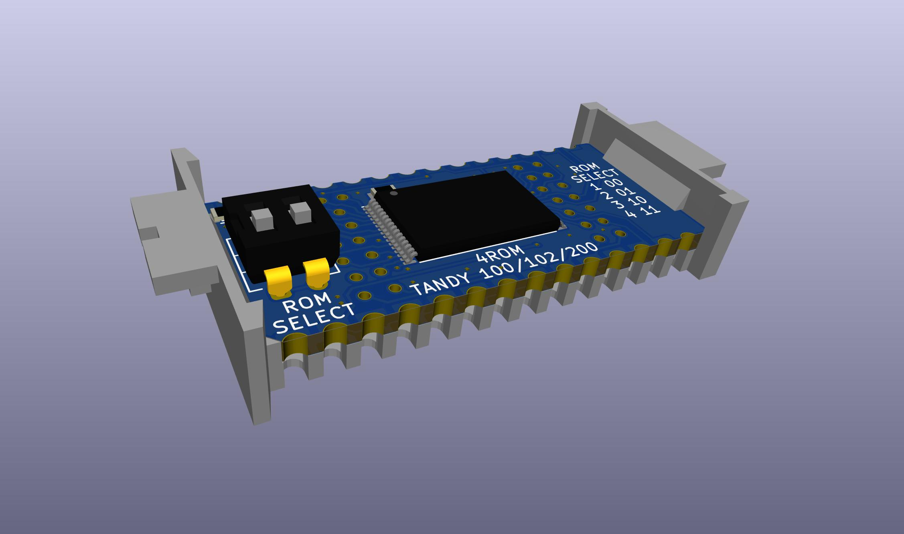
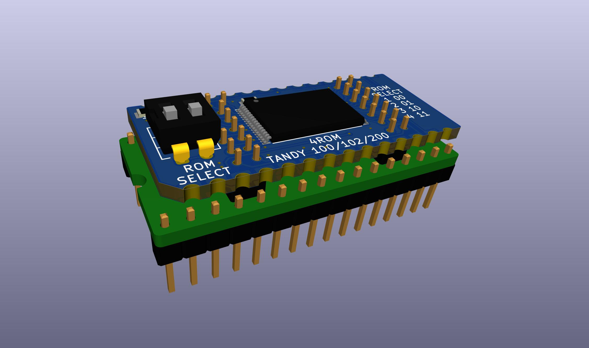

# 4ROM
or
# "Teeprom/Meeprom 2.0, The Overkilling"

### 4ROM_100 parts:  
PCB (pending verification)  
BOM https://www.digikey.com/short/whn7w258  
Carrier http://shpws.me/SGGB  

### 4ROM_78802 parts:  
PCB (pending verification)  
BOM https://www.digikey.com/short/whn7w258  
Carrier http://shpws.me/SGGB  

### 4ROM Programming Adapter parts:  
PCB (pending verification)  
BOM https://www.digikey.com/short/f3jhw9v1


This is a version of Teeprom and Meeprom that uses a 128K 29F010 flash instead of a 32K 28C256 eeprom.

When ordering the PCB:  
Select ENIG copper finish so the castellated edge contacts and programming adapter contacts are gold plated.  
Change the min tacks/spaces option to 6/6mils. The PCBWAY web site automatically selects 5/5 for this board for some reason, but there are no such thin traces or spaces.

The advantages over the original Teeprom are:  
* The flash chip is cheaper and more readily available. The 32K eeprom are now about $10 each and there is only one brand still being made. 128K flash is $1, and there are multiple brands and versions still in production.  
* The programming adapter is cheaper to buy and simpler to use than the soic test clip and wires needed for Teeprom.
* Holds four 32K rom images instead of one.  

The disadvantages are:  
* The board has more parts and is more difficult to solder.

There are 2 versions so far,  
4ROM_100 is only for TANDY 100, 102, & 200, same as Teeprom. This version is not tested yet.  

4ROM_78802 is for everything else, Same as Meeprom. Some examples: TANDY 600, Epson PX-4 & PX-8, general industrial applications, most anywhere the Molex 78805 socket is found.  
This version IS tested and working.

The parts other than the PCB are the same for both 100 and 78802 versions.  
The difference is only in the pinout of the edge connectors. TANDY 100, 102, & 200 have a non-standard pinout. The 78802 version provides a standard 27C256 pinout.  

The same programming adapter is used for both 100 and 78802.

##To write to the chip:  
* Put the programming adapter into a programmer.  
* Remove the 4ROM PCB from the carrier and connect it to the programming adapter by the center pins.  
* Select the desired bank with the slide switch on the 4ROM.  
* Tell the programmer to use device "SST39SF010A", ignore size mismatch, not to automatically erase the whole chip before writing.  
* Write a single 32K rom image.


Test the pin connections, just to verify that the board is soldered correctly and all of the programming adapter pins are making a good connection.  
It should say pins 1 and 2 are bad, and nothing else.  
```
$ minipro -p 'SST39SF010A' -z
Found TL866II+ 04.2.132 (0x284)
Bad contact on pin:1
Bad contact on pin:2
$
```

Really it's pins 2 and 3 that are not connected, but there is a bug in the minipro pin test, where each NC pin throws off the subsequent pin numbers. Pin 1 is a NC pin, so pins 2 and 3 end up saying 1 and 2.  
If/when minipro is updated to fix that bug, then this test should say bad contact on pins 2 and 3.  
Similarly if you're using the Windows app look for pins 2 and 3 to be missing but no other errors.  
The missing pins are because the two highest address bits A15 and A16 that exist on the flash chip are not connected to anything but the bank-select logic on the 4ROM board.

Erase the whole chip one time before writing any of the individual banks.  
```
$ minipro -p 'SST39SF010A' -u -E
Found TL866II+ 04.2.132 (0x284)
Chip ID: 0xBFB5  OK
Erasing... 0.40Sec OK
$
```

Select position "1" on the slide switch, and write one 32K rom image, with options to tell minipro NOT to erase the chip before the write, to unlock the chip before writing, to re-lock it after writing, and ignore the size mis-match from writing only 32K when 128K is expected.  
```
$ minipro -p 'SST39SF010A' -u -P -s -e -w MULTIPLAN.rom
Found TL866II+ 04.2.132 (0x284)
Chip ID: 0xBFB5  OK
Warning: Incorrect file size: 32768 (needed 131072)
Writing Code...  1.65Sec  OK
Reading Code...  0.25Sec  OK
Verification OK
$
```

Select position "2" on the slide switch, and repeat to write another rom.  
```
$ minipro -p 'SST39SF010A' -u -P -s -e -w BASIC.rom
Found TL866II+ 04.2.132 (0x284)
Chip ID: 0xBFB5  OK
Warning: Incorrect file size: 32768 (needed 131072)
Writing Code...  1.64Sec  OK
Reading Code...  0.25Sec  OK
Verification OK
$
```

<!-- 



-->


