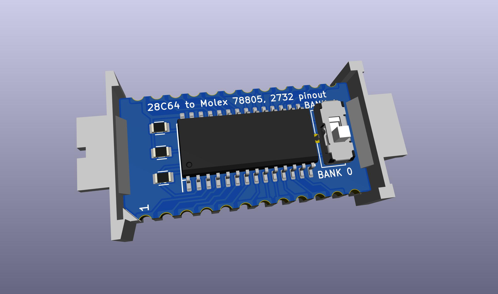
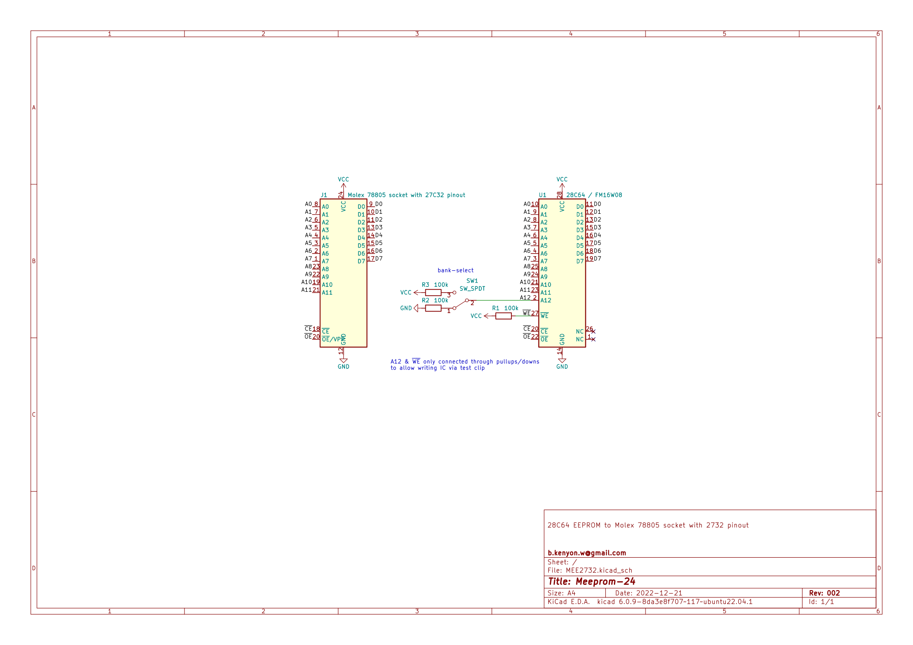
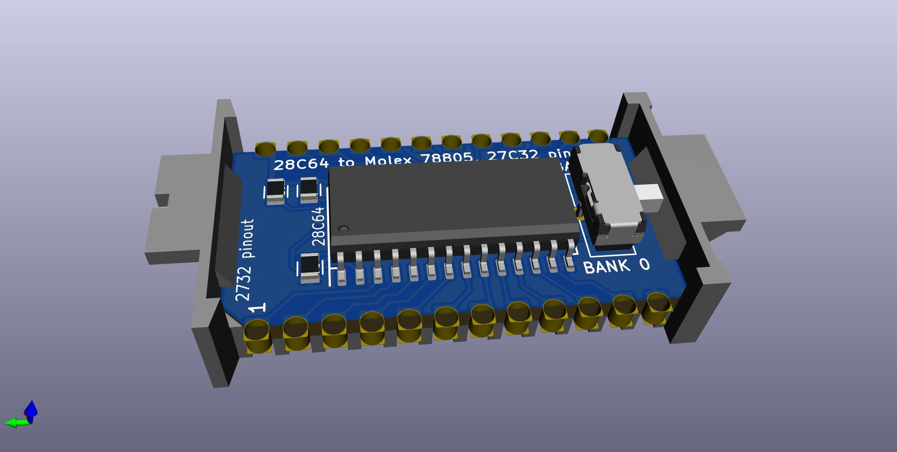
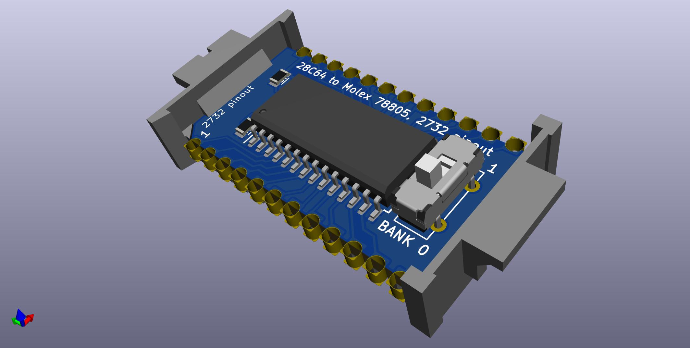
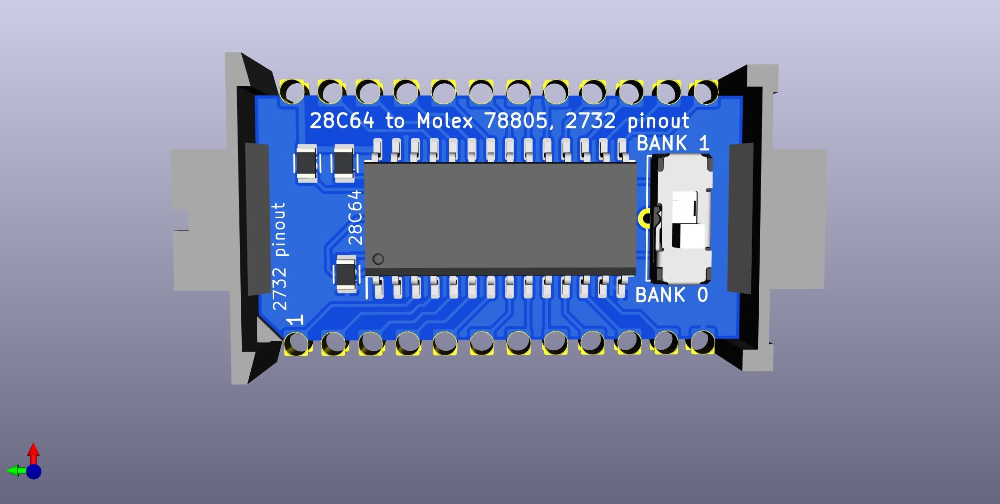
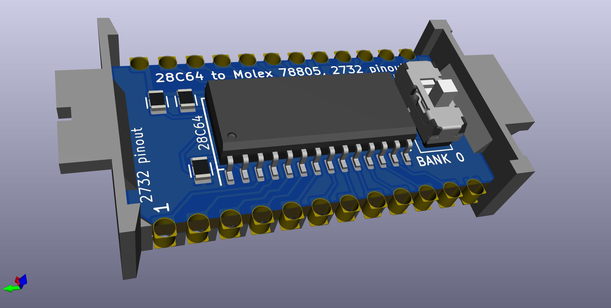
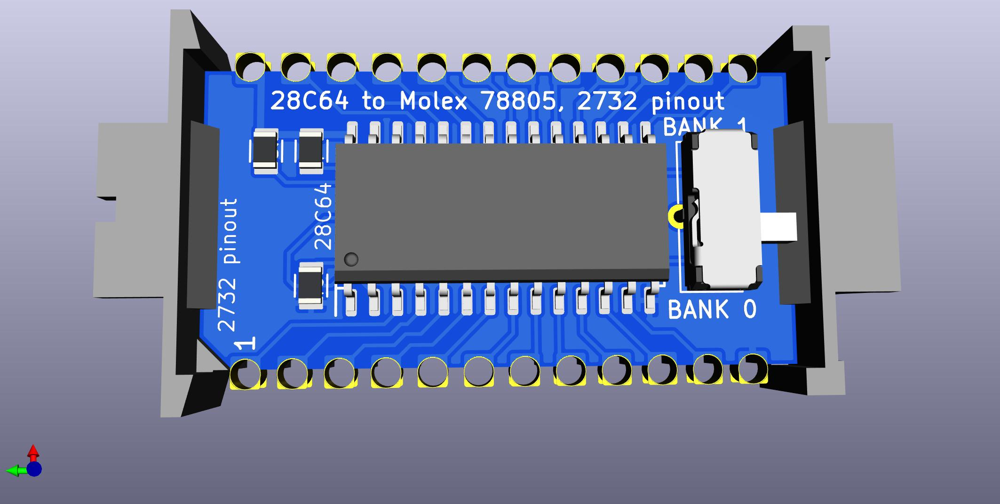
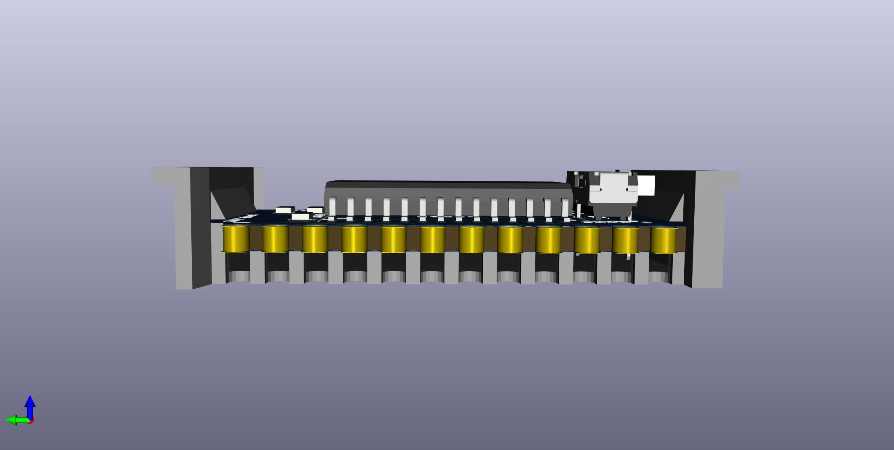
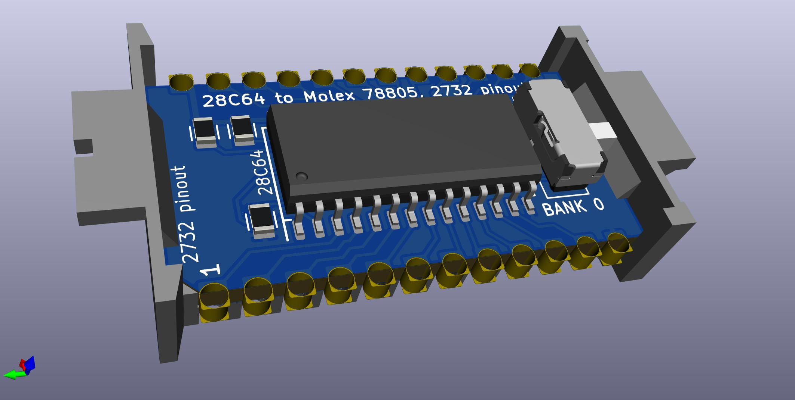

# MEE2732

24-pin with 2732 pinout.  
28C64 to provides 2 virtual 2732's.  
Programmable via SOIC-28 test clip.

PCB: https://oshpark.com/shared_projects/sVU04x8d  
BOM: https://www.digikey.com/short/fjhhqq27  
Carrier: http://shpws.me/SGYu  

## low profile version

To get a low-profile version where the switch does not stick out,  
just replace the switch [CL-SB-12C-02](https://www.digikey.com/short/3zrp84cr) with [CL-SB-12C-12](https://www.digikey.com/short/b9djbwmq) .

----

