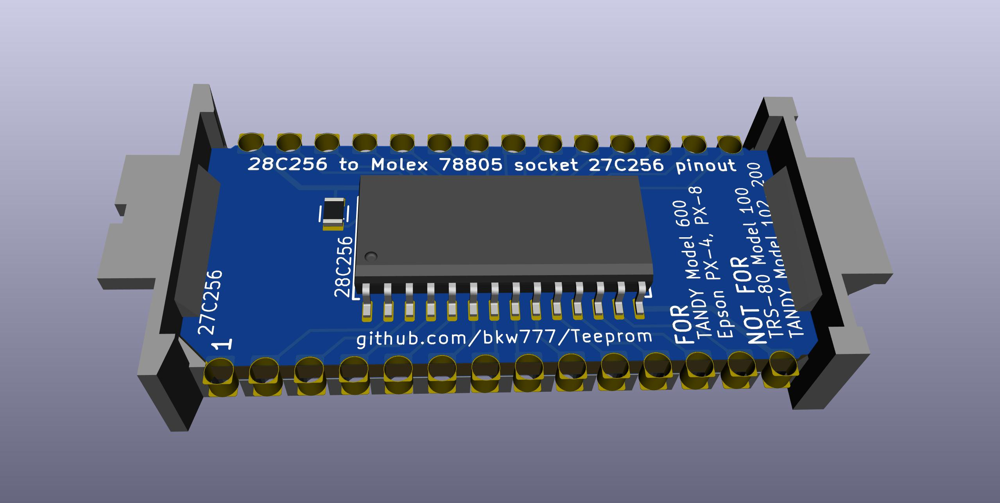

# Teeprom

[Teeprom](http://tandy.wiki/Teeprom) is an EEPROM module for Tandy Model 100, 102, & 200 portable computers.

# Meeprom

[Meeprom](http://tandy.wiki/Meeprom) is an EEPROM module for any other Molex 78805 socket that expects a 27C256 chip. Not for Model 100/200. Examples: Tandy Model 600, Epson PX-4, PX-8, Intermec 9440 & other similar handheld terminals, various industrial equipment like Allen Bradley SLC-500 PLCs.

# References
[Molex78802_Module](https://github.com/bkw777/Molex78802_Module)  

# FlashOpt100
or
[Teeprom 2.0, The Overkilling](Teeprom2.md)  
Version of Teeprom that uses a 29F010 flash instead of a 28C256 eeprom.
