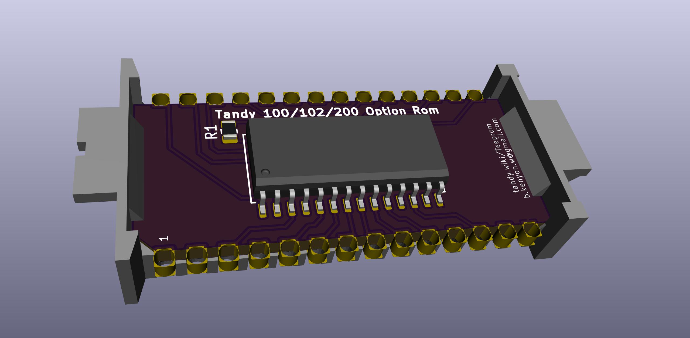
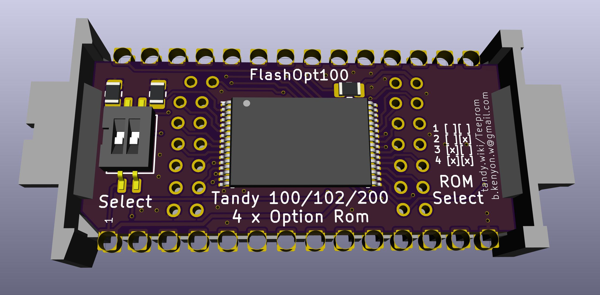
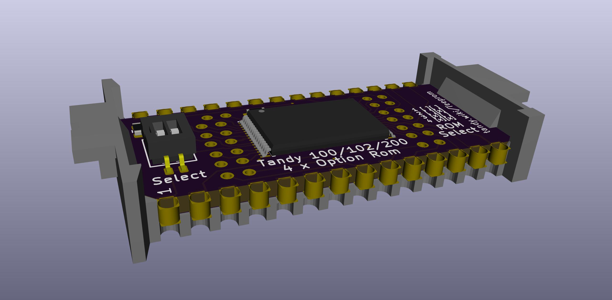
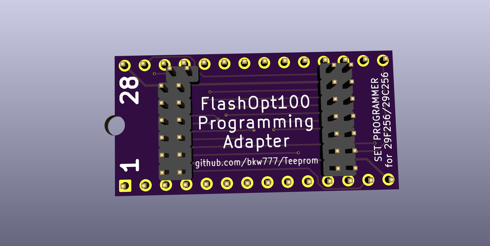
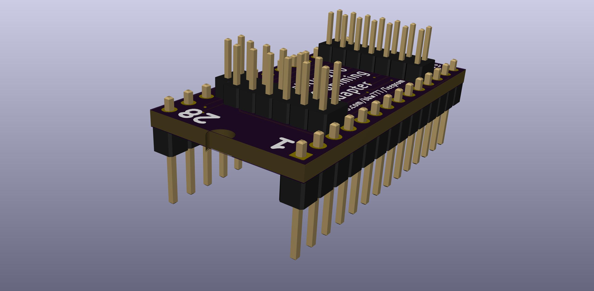
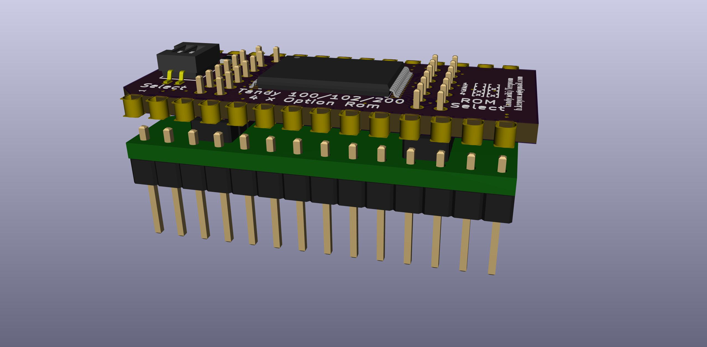

### Teeprom / Meeprom

[Teeprom](http://tandy.wiki/Teeprom) is an EEPROM module for Tandy Model 100, 102, & 200 protable computers.

[Meeprom](http://tandy.wiki/Meeprom) is an EEPROM module for any Molex 8878 socket that has a standard 27C256 pinout. (Tandy Model 600, Epson PX-8, PX-4, others?)

The carrier and a matching blank PCB template are [pcb2molex8878](http://github.com/aljex/pcb2molex8878).

### FlashOpt100
aka "Teeprom 2.0, The Overkilling"

Version of Teeprom that uses FLASH instead of EEPROM.

The advantages over the original Teeprom are:
* The chip is cheaper and more readily available, 32K EEPROM is over $9 each and there is only one brand still being made. 128K FLASH is under $1, and there are several brands and versions in current production.  
* The programming adapter is simpler to use and cheaper. Teeprom needs an SOIC test clip which is over $30 and requires 28 jumper wires and a dip socket or at least a couple single row pin headers. The programming adapter is all one piece and the parts are $5 or $6.  
* Holds four 32K rom images instead of just one.

The disadvantages are:  
* The board has more parts and is a little more work to build.  
* The TSOP chip is trickier to solder than the SOIC.  

The need to build the programming adapter for the flash board pretty evenly cancels out with the need to get and hook up an soic-28 test clip for the eeprom board. Though the programming adapter is easier and safer to use once built. It's polarity keyed at least between the adapter and the board.

FlashOpt100 parts:  
PCB https://oshpark.com/shared_projects/Axd3MxLI  
BOM https://www.digikey.com/short/zn0w7q  
Carrier https://www.digikey.com/short/zn021p  

FlashOpt100 programming adapter parts:  
PCB https://oshpark.com/shared_projects/JHvfBc2m  
BOM https://www.digikey.com/short/zn021p  

