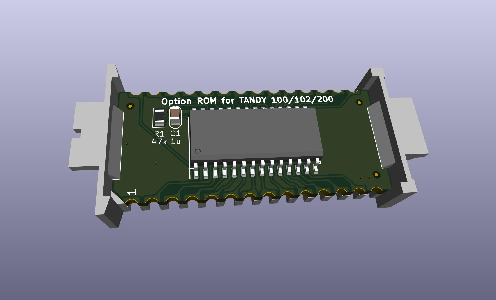

These are all virtual UV EPROMS / virtual mask roms, using electrically programmable EEPROM, FRAM, or FLASH with the pinout adapted to work in place of 27Cxx UV/OTP EPROMS or standard mask roms, on a specially shaped PCB and 3d-printed carrier to create a virtual Molex 78802 module to fit inside a Molex 78805 socket.

# Teeprom

[Teeprom](http://tandy.wiki/Teeprom) is an EEPROM module for Tandy Model 100, 102, & 200 portable computers.

# Meeprom

[Meeprom](http://tandy.wiki/Meeprom) is an EEPROM module for any other Molex 78805 socket that expects a 27C256 or standard mask rom chip. Not for Model 100/200. Examples: Tandy Model 600, Kyotronic KC-85, Epson PX-4, PX-8, handheld terminals like Intermec 9440, various industrial equipment like Allen Bradley SLC-500 PLCs, etc.

# MEE2732
Virtual 27C32 & virtual Molex 78802 carrier  

[MEE2732](MEE2732.md)  
24-pin 2732 pinout

# M4ROM
[M4ROM](https://github.com/bkw777/M4ROM)  
Version of Teeprom & Meeprom that uses a 29F010 flash instead of a 28C256 eeprom, and provides 4 32k rom images.

# References
[Molex78802_Module](https://github.com/bkw777/Molex78802_Module)  
