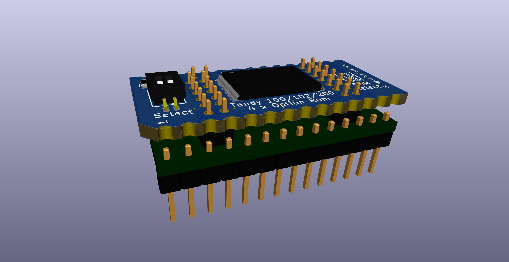

# FlashOpt100
or
# Teeprom 2.0, The Overkilling

Version of Teeprom that uses a 29F010 flash instead of a 28C256 eeprom.

NOT YET TESTED 2020-11-09

The advantages over the original Teeprom are:
* The flash chip is cheaper and more readily available. The 32K eeprom is over $9 each and there is only one brand still being made. 128K flash is $1, and there are multiple brands and versions still in current production.  
* The programming adapter is cheaper to buy and simpler and safer to use. Teeprom needs an SOIC-28 test clip which is over $30 just for the clip plus jumper wires and dip socket, and there's no polarity protection against connecting the wires backwards. The programming adapter for this is all one piece and the parts are about $6, and the connection between the flash board and the programming adapter is polarized. It's also simply faster and more convenient.  
* Holds four 32K rom images instead of just one.  

The disadvantages are:  
* The board has more parts, more work to build.  
* The TSOP flash chip is more difficult to solder than the SOIC eeprom.  

Current status of this version:  
The programming adapter connection doesn't work well. Always a few pins don't make good connection. This is probably fixable by just adjusting the offset positions of the holes some more.

### FlashOpt100 parts:  
PCB https://oshpark.com/shared_projects/mMOTuG3f  
BOM https://www.digikey.com/short/zn0w7q  
Carrier https://www.digikey.com/short/zn021p  

### FlashOpt100 programming adapter parts:  
PCB https://oshpark.com/shared_projects/IEB4EYu2  
BOM https://www.digikey.com/short/zn021p  

